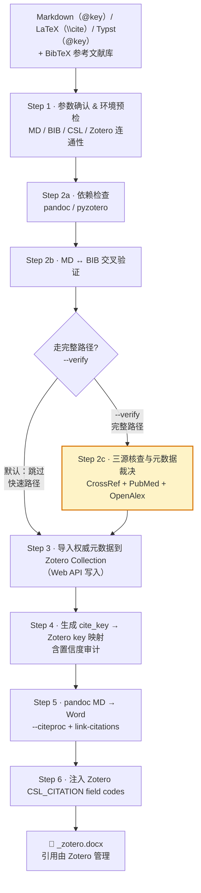

# md2word-skill

> **Markdown / LaTeX / Typst + BibTeX → Zotero 管理的 Word 文档**：把 pandoc 风格引用 `[@key]`、LaTeX `\cite{key}` 或 Typst `@key` 转成 Zotero `CSL_CITATION` field codes，让引用变成「活的」——由 Zotero 统一管理，可随时自动更新引用格式与参考文献列表。

[](./LICENSE)
[](#)
[](#前置条件与安装)

一个支持 Claude Code、Kiro CLI 等 70+ AI 工具的 Skill，专为「用 Markdown / LaTeX / Typst 写论文、用 Zotero 管文献、最终要交一份 Word」的科研写作工作流设计。

---

## 它解决什么问题

用 `pandoc --citeproc` 把 Markdown 转成 Word 是科研写作的常见做法，但它有一个根本缺陷：

> **pandoc 产出的引用是静态文本。** 一旦生成，引用编号、格式、参考文献列表就「焊死」在 docx 里。后续要补一篇文献、换期刊格式、或修正 BIB 里的作者名拼写错误，只能改源文件重跑——而合作者（导师/编辑）在 Word 里改的东西全部丢失。

`md2word-skill` 不让 pandoc 负责最终的引用渲染，而是**把引用替换成 Zotero 的 field codes**（`ZOTERO_ITEM CSL_CITATION`）。这样：

- ✅ Word 里的每个引用都**指向 Zotero 库**，与 Zotero 客户端里的引用完全等价
- ✅ 换引用格式（author-date ↔ numeric）、补/删文献、刷新参考文献列表——在 Word 里点 Zotero 的 **Refresh** 即可，无需重跑转换
- ✅ 投稿不同期刊时，换 CSL 样式重渲染，全文引用自动跟着变

并且，导入 Zotero 的文献元数据**不直接信任你的 BIB**，而是经过 **CrossRef + PubMed + OpenAlex 三源裁决**，用权威数据源覆盖 BIB 里的常见错误（作者名、年份、卷期页）。

---

## 核心特性

- **🔗 Zotero field-code 注入** — 把 `[@key]`/`\cite{key}` 转成 `CSL_CITATION`，引用由 Zotero 统一管理，可在 Word 内 Refresh
- **📄 三输入格式** — 支持 Markdown（`[@key]`）、LaTeX（`\cite{}`/`\citep{}`/`\citet{}` 等所有变体）以及 **Typst**（`@key` + `#bibliography()`）
- **🛡️ 三源元数据裁决** — CrossRef / PubMed / OpenAlex 交叉核对，用权威数据修正 BIB 错误（不信任 BIB）
- **📊 置信度审计** — 每个 cite_key→Zotero 映射标注 `high/medium/low` 置信度与锚点（DOI / 标题 / bib），便于人工复核
- **📑 CSL 驱动** — 内置 `physics-in-medicine-and-biology`（PMB）样式，支持任意 CSL；自动识别 `author-date / numeric / note` 三种引用格式并选对应注入策略
- **⚡ 双路径** — 快速路径（BIB 已在 Zotero，本地 API 直接建映射，~20s）与完整路径（三源核查后导入，~100–180s）按需切换
- **🔨 Makefile 支持** — `make all` 同时生成 PDF（xelatex）和 Word；`make typ-pdf` 用 `typst compile` 生成 Typst PDF；`make word-typ` 走 Typst → docx → Zotero 注入
- **🤖 多 AI 工具原生** — Claude Code 输入 `/md2word`，Kiro 切换 `/agent md2word`；`npx skills add` 一键安装

---

## 工作流程总览



| 路径 | 步骤 | 耗时 | 适用场景 |
|------|------|------|----------|
| **快速路径**（默认） | 1 → 2a+2b → 3 → 4 → 5 → 6 | ≈ 40s | 信任 BIB 质量、内部草稿迭代 |
| **完整路径**（`--verify`） | 1 → 2a+2b+**2c** → 3 → 4 → 5 → 6 | ≈ 100–180s | **投稿前终审**，需修正 BIB 错误 |

> 未明确要求时默认走快速路径；说「核查 / 验证文献 / verify」即走完整路径。

### 六步流程

| Step | 说明 | 详情 |
|------|------|------|
| 1 | 收集参数 & 环境预检（MD/TEX/TYP/BIB/CSL/Zotero 连通性） | [`docs/step1.md`](./docs/step1.md) |
| 2 | 依赖检查 + ↔BIB 交叉验证 [+ 三源核查与裁决] | [`docs/step2.md`](./docs/step2.md) |
| 3 | 创建 Collection + 导入权威元数据 | [`docs/step3.md`](./docs/step3.md) |
| 4 | 映射 cite_key → Zotero key（含置信度/审计） | [`docs/step4.md`](./docs/step4.md) |
| 5 | pandoc → Word（`--citeproc`，支持 `.md` / `.tex` / `.typ`） | [`docs/step5.md`](./docs/step5.md)（Typst 需 pandoc ≥ 3.6） |
| 6 | 注入 Zotero field codes | [`docs/step6.md`](./docs/step6.md) |

---

## 前置条件与安装

### 1. 安装 Skill

**推荐：使用 [npx skills](https://github.com/vercel-labs/skills)（自动检测已安装的 AI 工具并 symlink）**

```bash
# 全局安装（所有项目可用）
npx skills add JRob319/md2word-skill -g

# 仅安装到指定 agent
npx skills add JRob319/md2word-skill -g -a claude-code
npx skills add JRob319/md2word-skill -g -a kiro-cli
```

支持 Claude Code、Kiro CLI、Cursor、Codex 等 70+ 个 AI 工具，自动识别已安装的 agent。

**手动安装：**

```bash
# Claude Code
git clone https://github.com/JRob319/md2word-skill.git ~/.claude/skills/md2word-skill

# Kiro CLI
git clone https://github.com/JRob319/md2word-skill.git ~/.kiro/skills/md2word-skill
```

重启 AI 工具后即可触发（Claude Code 输入 `/md2word`，Kiro 切换 `/agent md2word`）。

### 2. 系统依赖

| 依赖 | 版本 | 用途 | 安装 |
|------|------|------|------|
| **pandoc** | ≥ 3.6 | → Word（`--citeproc`，`.md` / `.tex` / `.typ` 输入） | [pandoc.org/installing](https://pandoc.org/installing.html)<br>`winget install pandoc` / `pacman -S pandoc` / `apt install pandoc` / `brew install pandoc` |
| **Zotero 桌面版** | 任意 | 文献库，运行中 | [zotero.org/download](https://www.zotero.org/download/) |
| **typst** | ≥ 0.12 | **可选**：`.typ` → PDF | [typst.app](https://typst.app/)<br>`pacman -S typst` / `winget install typst` / `cargo install typst-cli` / `brew install typst` |
| **Python** | ≥ 3.8 | 运行三个脚本 | [python.org](https://www.python.org/)<br>`winget install Python.Python` / `pacman -S python` / `apt install python3` / `brew install python` |

Python 包（推荐用 uv 创建隔离环境）：

```bash
# 推荐：uv（隔离环境，首次 bash run.sh 自动完成）
cd md2word-skill && uv venv .venv && uv pip install -r pyproject.toml

# 或者 pip
pip install pyzotero python-docx lxml bibtexparser
```

### 3. Zotero API：Local 与 Web

| API | 端点 | 权限 | 在本 skill 的角色 |
|-----|------|------|-------------------|
| **Local API** | `http://localhost:23119` | **只读** | 检查 collections、读取库、建映射（需 Zotero 桌面运行） |
| **Web API** | `https://api.zotero.org` | **读写** | **可选**：仅完整路径（BIB 未导入 Zotero 时）需要 |

**快速路径**（BIB 从 Zotero 导出）：只需本地 API，无需配置 Web API。

**完整路径**（BIB 来自外部，需三源核查后导入）：需配置 Web API 凭证：

1. 访问 <https://www.zotero.org/settings/keys>，新建 key，勾选「Allow library access」+「Allow write access」
2. 同页面底部获取数字 User ID

```bash
export ZOTERO_API_KEY="你的API Key"
export ZOTERO_USER_ID="你的数字 User ID"
```

写入 shell 配置（`~/.zshrc` / `~/.bashrc`）：

```bash
export ZOTERO_API_KEY="你的API Key"
export ZOTERO_USER_ID="你的数字 User ID"
```

`source` 生效后，Step 1b 会自动检测两套 API 的连通性。

---

## 快速开始

准备两个文件——一个含引用的 Markdown / LaTeX / Typst，一个 BibTeX：

**`paper.md`**（Markdown 风格）：
```markdown
# 引言

Optimal Transport Conditional Flow Matching 已被证明
能有效学习概率路径 [@lipman2023flow; @tong2023flow]。
```

**`paper.tex`**（LaTeX 风格）：
```latex
\section{引言}
Optimal Transport Conditional Flow Matching 已被证明
能有效学习概率路径 \citep{lipman2023flow, tong2023flow}。
```

**`paper.typ`**（Typst 风格）：
```typst
= 引言

Optimal Transport Conditional Flow Matching 已被证明
能有效学习概率路径 @lipman2023flow @tong2023flow。

#bibliography("refs.bib")
```

**`refs.bib`**（节选）：
```bibtex
@article{lipman2023flow,
  title   = {Flow Matching for Generative Modeling},
  author  = {Lipman, Yaron and ...},
  doi     = {10.48550/arXiv.2210.02747}
}
```

在 Claude Code / Kiro 里：

```
/md2word paper.tex refs.bib
```

或者直接用 Makefile（修改 `TEXFILE` / `TYPFILE` / `BIBFILE` 变量后）：

```bash
make all        # 同时生成 LaTeX PDF + Word
make word       # LaTeX 转 Word
make pdf        # LaTeX → PDF（latexmk -xelatex）
make typ-pdf    # Typst → PDF（typst compile）
make word-typ   # Typst 转 Word → Zotero 注入
```

最终产出：

```
paper_zotero.docx   # 引用为 Zotero field codes，可 Refresh
paper.pdf           # xelatex 编译的 PDF
```

用 Word/WPS 打开 docx，所有引用都已绑定 Zotero 库，点 Zotero 插件的 **Refresh** 重渲染引用，**Add Bibliography** 插入参考文献列表。

---


### 输出约定

- 所有中间文件与最终产物默认写到 **MD/BIB 所在目录**（`OUTDIR`）
- 最终文件名：`<文件名>_zotero.docx`（LaTeX）、`<文件名>_typ_zotero.docx`（Typst）、`<文件名>_md_zotero.docx`（Markdown）
- 中间产物：`verify_result.json`、`mapping.json`、`pandoc_output.docx`（LaTeX）、`pandoc_output_typ.docx`（Typst）、`pandoc_output_md.docx`（Markdown）

---

## 三源裁决机制

为什么不直接导入 BIB？因为 BIB 文件里作者名拼错、年份偏差、卷期页缺失太常见。本 skill 在 Step 2c 对每条文献查询三个免费、无需 key 的权威数据源，交叉裁决后**用权威元数据覆盖 BIB**：

| 数据源 | 强项 | 角色 |
|--------|------|------|
| **CrossRef** | 出版商直供的 DOI / 期刊 / 卷期页 / 年份 | 期刊与出版信息的首选源 |
| **PubMed**（NCBI E-utilities） | 生物医学金标准，作者全名最规范（NLM 独立策展） | 作者信息的首选源 |
| **OpenAlex** | 覆盖最广，含作者机构 / ORCID | 补全覆盖面 |

**裁决流程**：归一化消除假冲突 → 判定是否同一篇 → 四档处置：

| 档位 | 含义 | 处理 |
|------|------|------|
| ✅ **PASS** | 三源一致（或归一化后一致） | 用权威元数据导入 |
| ⚠️ **FLAG** | 实质冲突但有合理默认 | 默认**不阻塞**，用最优值导入，冲突写入 Zotero `Extra` 字段；`--strict` 时阻塞 |
| ❌ **REJECT** | 不像同一篇（标题/作者/年份不匹配） | **不导入**（避免污染库） |
| ⏭ **SKIP** | 三源均未找到 | **不导入**；`--import-skip` 可强制用 BIB 原值导入并标记「未验证」 |

**字段最优源**（真冲突时取谁）：作者优先 **PubMed**，期刊/卷期页/年份优先 **CrossRef**。

> 💡 源并不独立：OpenAlex 大量数据继承自 CrossRef，因此不简单数人头；PubMed 的独立一票分量更高。

---

## CSL 样式与配置

引用格式、参考文献列表格式、注入策略**都由 CSL 决定**，是工作流核心。

- **默认样式**：`styles/xxx.csl`（PMB，author-date）, pandoc 会自动解析，无需额外配置。
- **换用其他样式**：提供 CSL 文件路径或 URL 即可。换 numeric 期刊（如 IEEE）时，Step 5/6 会自动检测 `citation-format` 并切换到编号注入策略; 或者先默认csl完整整个过程后，在zotero里选其他的样式
- **CSL 缺失**：列出 `styles/` 下已有样式并提示用户下载。

---

## 项目结构

```
md2word-skill/
├── SKILL.md                      # Skill 入口（AI 加载）：流程总览 + 渐进式读取约定
├── README.md                     # 本文档
├── LICENSE                       # MIT
├── Makefile                      # make all/pdf/word/word-typ/typ-pdf/clean/cleanall
├── pyproject.toml                # Python 依赖声明（uv/pip）
├── run.sh                        # Linux/macOS/WSL 脚本入口（自动激活 .venv）
├── run.bat                       # Windows 原生脚本入口
├── test_paper.md                 # 测试用 Markdown 文件
├── test_paper.tex                # 测试用 LaTeX 文件
├── test_paper.typ                # 测试用 Typst 文件
├── docs/
│   ├── step1.md                  # Step 1: 参数确认 & 环境预检
│   ├── step2.md                  # Step 2: 依赖检查 + 交叉验证 + 三源核查
│   ├── step3.md                  # Step 3: 创建 Collection + 导入权威元数据
│   ├── step4.md                  # Step 4: cite_key → Zotero key 映射（含置信度）
│   ├── step5.md                  # Step 5: pandoc 输入文件 → Word
│   └── step6.md                  # Step 6: 注入 Zotero field codes
├── scripts/
│   ├── verify_references.py      # 交叉验证 + 三源核查与裁决（支持 .md/.tex）
│   ├── import_zotero.py          # 用权威元数据导入 Zotero（完整路径）
│   └── inject_zotero.py          # 注入 CSL_CITATION field codes
└── styles/
    ├── physics-in-medicine-and-biology.csl   # 默认 CSL（dependent）
    └── institute-of-physics-harvard.csl      # parent CSL
```

---


## License

[MIT](./LICENSE) © 2026 luciliang, JRob319
